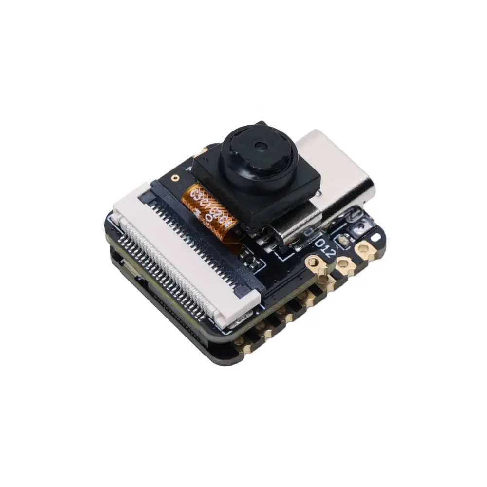

# XIAO ESP32S3 Sense Camera for MicroPython

A MicroPython library that unlocks the **OV2640 / OV3660 / OV5640** camera on the **Seeed Studio XIAO ESP32S3 Sense** on MicroPython.

Stock MicroPython has **no camera driver** — the OV2640 needs an 8-bit DVP parallel bus clocked at 20 MHz with DMA. This project solves it by combining:

1. **Prebuilt firmware** — [cnadler86/micropython-camera-API](https://github.com/cnadler86/micropython-camera-API) (user C module wrapping Espressif's `esp32-camera` v2.1.7) with the XIAO pin map baked in (`MICROPY_CAMERA_MODEL_XIAO_ESP32S3`, octal PSRAM).
2. **Pure-Python library `xiao_sense`** — friendly defaults, JPEG capture, SD card, streaming, timelapse & motion helpers on top of `camera`.

> **Why not pure Python?** You can't bit-bang DVP at pixel-clock speeds. The `camera` C module must be baked into firmware. After that, everything else is Python.

## Quick Start (2 commands)

Flash the prebuilt firmware, then copy the library.

### 1) Flash firmware

**Using esptool**

```bash
pip install esptool
# download the .bin from releases (see firmware/README.md)
esptool --chip esp32s3 --port COM3 --baud 460800 write-flash -z 0x0 XIAO_ESP32S3_SENSE-camera-*.bin
```

### 2) Install the Python library

```bash
# with mpremote (recommended)
mpremote mip install github:PrathamGhaywat/cam-api-mcpy

# or manually copy lib/xiao_sense/ to the board as /lib/xiao_sense/
mpremote cp -r lib/xiao_sense :lib/xiao_sense
```

### 3) Hello camera

```python
from xiao_sense import XiaoCamera
from xiao_sense.camera import FrameSize, PixelFormat  # re-exported

cam = XiaoCamera(frame_size=FrameSize.VGA)  # XIAO pins auto-configured
jpeg = cam.capture()           # memoryview of JPEG bytes
print("captured", len(jpeg), "bytes", cam.width, "x", cam.height)

with open("photo.jpg","wb") as f:
    f.write(jpeg)
cam.deinit()
```

More examples: `examples/`.

## Board Pin Map (hard fact)

Verified against [Seeed wiki](https://wiki.seeedstudio.com/xiao_esp32s3_camera_usage/) and `camera_pins.h`:

```
PWDN=-1  RESET=-1  XCLK=10  SIOD=40  SIOC=39
Y9=48  Y8=11  Y7=12  Y6=14  Y5=16  Y4=18  Y3=17  Y2=15
VSYNC=38  HREF=47  PCLK=13
xclk_freq=20_000_000  fb_location=PSRAM  fb_count=2
```

The board shares GPIO41/42 between PDM mic and camera — don't use both at once.

## Library API

```python
from xiao_sense import XiaoCamera
from xiao_sense.camera import FrameSize, PixelFormat, GrabMode, GainCeiling

cam = XiaoCamera(
    frame_size=FrameSize.SVGA,
    pixel_format=PixelFormat.JPEG,  # JPEG, RGB565, GRAYSCALE, YUV422
    jpeg_quality=85,                 # 0..100
    fb_count=2,
    grab_mode=GrabMode.LATEST,
)
buf = cam.capture()                  # memoryview
cam.capture_to_file("/photo.jpg")    # save directly
cam.reconfigure(frame_size=FrameSize.QVGA)
cam.quality = 90                     # property style (full list below)
print(cam.sensor_name, cam.width, cam.height)
cam.deinit()
```

Properties (read/write unless noted): `frame_size`, `contrast`, `brightness`, `saturation`, `sharpness`, `denoise`, `gainceiling`, `quality`, `colorbar`, `whitebal`, `gain_ctrl`, `exposure_ctrl`, `hmirror`, `vflip`, `aec2`, `awb_gain`, `agc_gain`, `aec_value`, `special_effect`, `wb_mode`, `ae_level`, `dcw`, `bpc`, `wpc`, `raw_gma`, `lenc` plus read-only `pixel_format`, `grab_mode`, `fb_count`, `pixel_width`, `pixel_height`, `max_frame_size`, `sensor_name`.

### SD card

```python
import xiao_sense.sdcard as sd
sd.mount()                       # auto-detect CS=21 on expansion board SPI(7,8,9)
cam.capture_to_file("/sd/photo.jpg")
sd.umount()
```

### Streaming (browser viewable MJPEG)

```python
from xiao_sense import XiaoCamera
from xiao_sense.stream import start_stream
import network
# connect wifi first ...
cam = XiaoCamera(frame_size=FrameSize.VGA)
start_stream(cam, port=80)  # visit http://<ip>/
```

### Timelapse

```python
cam.timelapse(count=100, interval_s=5, prefix="/sd/tl_", on_capture=lambda n,p: print(n,p))
```

### Motion detection

Grayscale differencing (no extra model):

```python
for evt in cam.motion_stream(threshold=12, min_pixels=800):
    print("motion!", evt)
    cam.capture_to_file("/sd/motion.jpg")
```

## Repo Layout

```
cam-api-mcpy/
  lib/xiao_sense/      # copy to board as /lib/xiao_sense
    __init__.py
    camera.py          # XiaoCamera wrapper
    pins.py            # XIAO pin constants
    sdcard.py          # SD mount helpers
    stream.py          # MJPEG server
    utils.py
  examples/
    01_hello_world.py
    02_photo_to_flash.py
    03_photo_to_sd.py
    04_web_stream.py
    05_timelapse.py
    06_motion_detection.py
    07_sensor_tuning.py
  firmware/
    README.md          # flashing guide
  .github/workflows/build.yml  # CI builds octal-PSRAM firmware if you don't want Docker
```

## Firmware Build (CI, no local toolchain)

You requested **prebuilt/CI only** (no local Docker).

- Prebuilt: download from [micropython-camera-API releases](https://github.com/cnadler86/micropython-camera-API/releases) — pick `XIAO_ESP32S3` or `ESP32_GENERIC_S3-SPIRAM_OCT` variant.
- CI build: push a tag `v*` and `.github/workflows/build.yml` builds a fresh `XIAO_ESP32S3 Sense` firmware with `CONFIG_SPIRAM_MODE_OCT` and uploads the `.bin` as an artifact/release. See `firmware/README.md`.

If you ever want a local build, see the same workflow — it runs in `espressif/idf:v5.2.3`.

## Troubleshooting

- `OSError: Camera init failed` -> wrong firmware variant (needs octal PSRAM), camera not seated, or pins missing. Try the `XIAO_ESP32S3` specific build, not generic quad.
- `No image` at high resolutions -> PSRAM not enabled or FB in DRAM fallback; flash the octal build and use `PIXFORMAT_JPEG` with `fb_count=2`.
- SD `mount failed` -> card needs FAT32, CS=21, SPI pins 7/8/9, and 3.3V. Try another card.
- `MemoryError` after streaming -> `cam.free_buffer()` or lower `frame_size`/`quality`.

## Credits & License

- C driver: [espressif/esp32-camera](https://github.com/espressif/esp32-camera) (Apache 2.0)
- MicroPython camera API: [cnadler86/micropython-camera-API](https://github.com/cnadler86/micropython-camera-API) (MIT, CircuitPython-derived)
- This Python library: MIT — see `LICENSE`.

PRs welcome. Flash, capture, stream.
